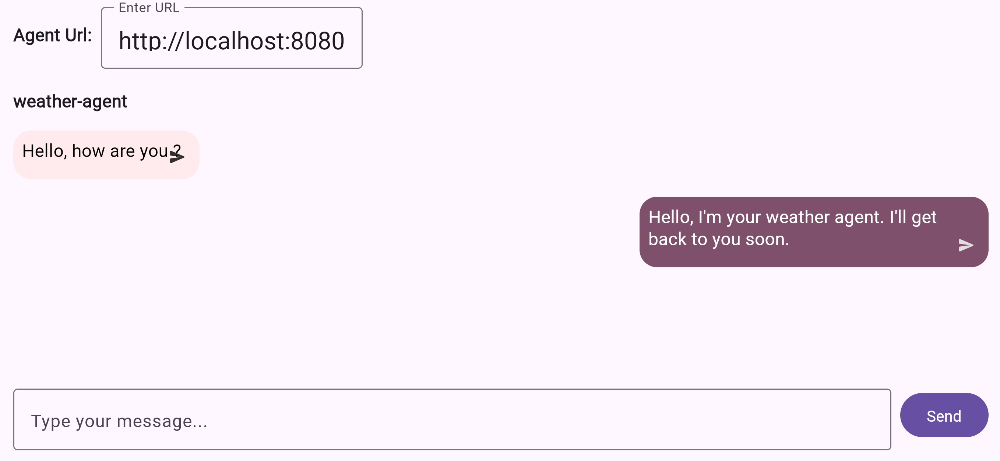
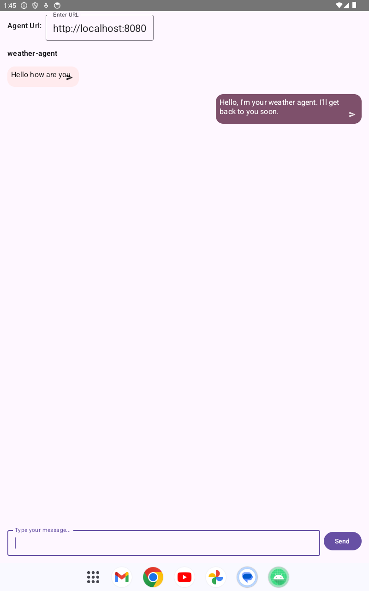

# Ark View

The Ark View is an attempt of Kotlin Multiplatform Port of LMOS official UI application for communicating with an Arc Agent service (see original project for details [arc-view](https://github.com/eclipse-lmos/arc-view/tree/main).





## Build and Run

### Docker 

Start ngnix server hosting wasm application:

```shell
docker run --rm -p 8080:80 ghcr.io/michalharakal/ark-view
```

## Code of Conduct

This project has adopted the [Contributor Covenant](https://www.contributor-covenant.org/) in version 2.1 as our code of conduct. Please see the details in our [CODE_OF_CONDUCT.md](CODE_OF_CONDUCT.md). All contributors must abide by the code of conduct.

By participating in this project, you agree to abide by its [Code of Conduct](./CODE_OF_CONDUCT.md) at all times.

## Licensing
Copyright (c) 2025 Deutsche Telekom AG and others.

Sourcecode licensed under the [Apache License, Version 2.0](https://www.apache.org/licenses/LICENSE-2.0) (the "License"); you may not use this project except in compliance with the License.

This project follows the [REUSE standard for software licensing](https://reuse.software/).    
Each file contains copyright and license information, and license texts can be found in the [./LICENSES](./LICENSES) folder. For more information visit https://reuse.software/.

Unless required by applicable law or agreed to in writing, software distributed under the License is distributed on an "AS IS" BASIS, WITHOUT WARRANTIES OR CONDITIONS OF ANY KIND, either express or implied. See the LICENSE for the specific language governing permissions and limitations under the License.